# Map synthesis based on satellite images

## Table of Contents
- [1. Motivation](##1.-motivation)
- [2. Literature Review](##2.-literature-Review)
- [3. Methodology](##3.-methodology)
	- [3.1. Datasets](###3.1.-datasets)

## 1. Motivation

Map-related services are essential in our daily life, as we utilize maps for various scenarios/applications, e.g., daily
commuting navigation, logistics distribution system, queries and visualization of geographic information, request of
high-definition maps for self-driving vehicles, etc. Therefore, generating applicable maps and maintaining their latest
versions are important tasks, which, unfortunately, can be a laborious and time-consuming process. Nowadays, most maps
are created and updated based on the interpretation of aerial/satellite images and field surveys. On the bright side,
with the rapid development of remote sensing technologies, many high spatial resolution (HSR) satellite images with a
global coverage can be obtained frequently by sensors on aircraft/satellites. Thus, **generating map tiles automatically
and aesthetically based on satellite images** has become an emerging research direction for mapping agencies and
institutions.

> *Figure 1. Comparison results of MapGAN (Li et al., 2020) and some other image translation models in the one-to-one domain map generation experiment to generate Google maps. The images from left to right are satellite images and the Google maps generated by MapGAN, Pix2pix, BicycleGAN, the MSGAN, and MapGAN, the real Google maps.*

## 2. Literature Review

**Generative Adversarial Network (GAN)**, a framework for estimating generative models via an adversarial process, was
first proposed (Goodfellow et al., 2014) with two models being trained simultaneously: a generative model G that
captures the data distribution, and a discriminative model D that estimates the probability that a sample came from the
training data rather than G. The training procedure for G is to maximize the probability of D making a mistake. This
framework corresponds to a minimax two-player game.

Later, researchers have experimented with their proposed GANs on the translation task using satellite images and
Google maps. However, the purpose of previous map translation tasks was mainly to prove the feasibility of their
proposed model. That is, as long as the generated images were in the style of applicable electronic maps, they were
satisfied with the results, even although the quality of generated maps was far from ideal, and it was easy for people
to distinguish between the real electronic maps and the generated ones. For example, Pix2pix (Isola et al., 2017)
established a general framework for image translation based on a CGAN (Mirza & Osindero, 2014). However, satisfactory
results cannot be achieved in specific scenarios, and the quality of the generated electronic map is poor. A
breakthrough of CycleGAN (Zhu et al., 2017) is its ability to solve the problem of image translation in cases where
paired training datasets cannot be obtained. When it is applied in the map translation scenario, it is still found that
the resulting electronic map has many problems, such as image blurring, unclear texture, and incorrect color rendering.
Furthermore, there are two other recent, promising, and GAN-based studies for image translation, e.g., BicycleGAN (Zhu et al., 2017) and StarGAN (Choi et al., 2020), which focus on generating images with multiple styles/domains, and therefore are well worth exploring.

## 3. Methodology

### 3.1. Datasets

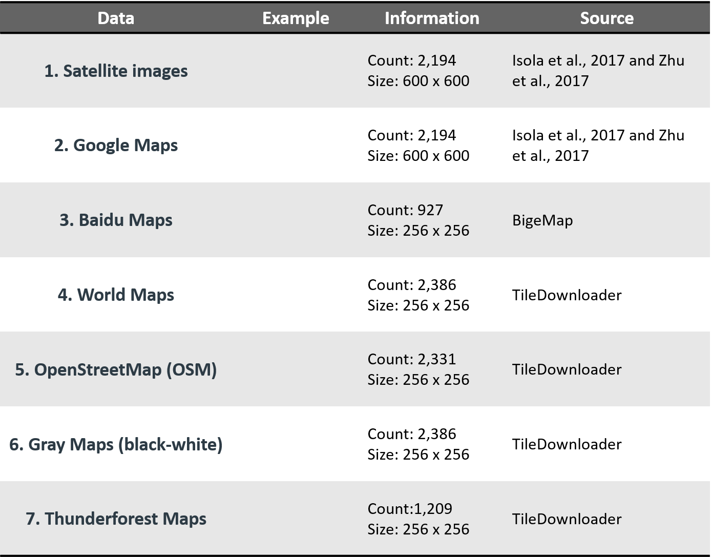
> Figure 2. Seven datasets with detailed information in our project. 

> The first one is satellite images, which are the source for image translation. On the other hand, we collected six different kinds of targeted maps, such as google maps, baidu maps, world maps, etc.

### 3.2. State-of-the-art models for image translation

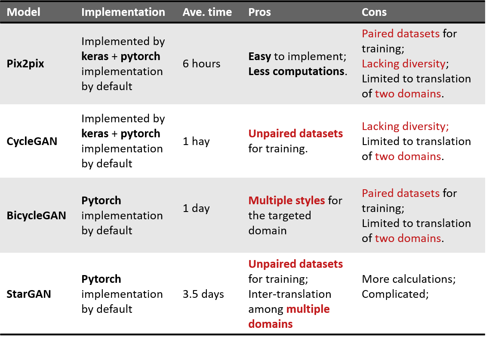
> Figure 3. summary of four state-of-the-art models for image translation

#### 3.2.1. Pix2pix

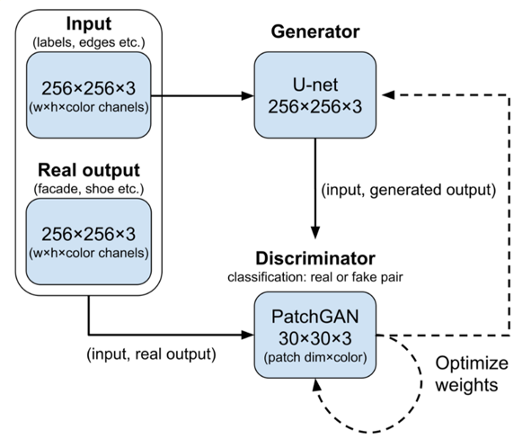
> Figure 4. architecture of pix2pix includes a U-net Generator and a PatchGAN discriminator. It is easy to implement with less computations, however, one of the disadvantages is that it requires paired datasets for training.

#### 3.2.2. CycleGAN

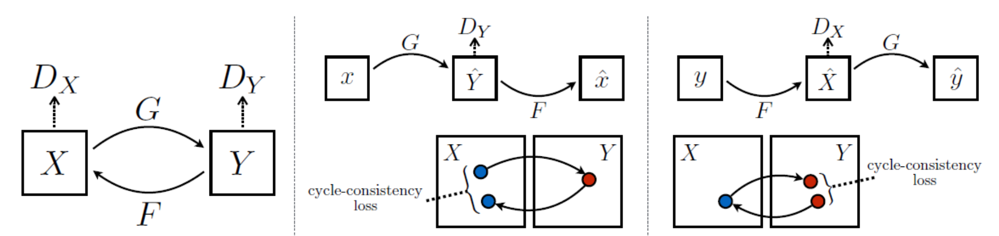
> Figure 5. CycleGan doesn't require paired datasets for training. The architecture of CycleGAN includes two generators G and F. G generates Y domain images based on X domain input, while F generates the versus. The cycle process is constrained by the cycle-consistency loss. However, one of the disadvantages for CycleGAN is lacking diversity of styles for the output.

#### 3.2.3. BicycleGAN

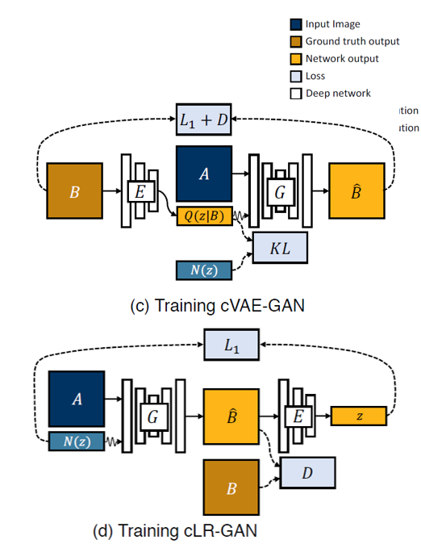
> Figure 6. BicycleGAN can produce multiple styles for the targeted domain. The architecture of BicycleGAN includes two cycle processes. One involves the ground truth B versus the output B hat, And the other cycle is about a randomly sampled latent code versus the reconstructed latent code. However, one of the weaknesses is that BicycleGAN performs image translation only between two domains.

#### 3.2.4. StanGAN

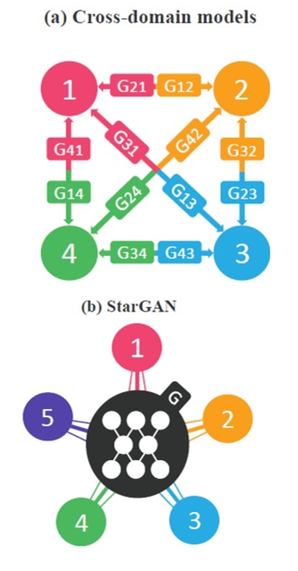
> Figure 7. StarGAN can produce multiple domains (for example, 5 domains here) with only ONE generator, instead of calculating n * (n-1) generators if we have n domains.

### 3.3. Workflow

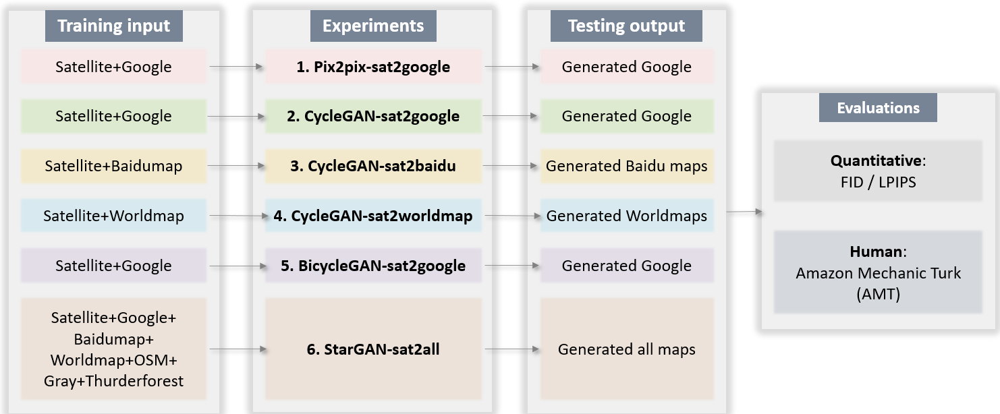
> Figure 8. We conducted 6 experiments with different GAN models and different targeted domains. Each experiment will be fed with its corresponding training input, and then produce the output. And each output will be evaluated by quantitative metrics as well as Human evaluation.

## 4. Results

### 4.1. Pix2pix-sat2google

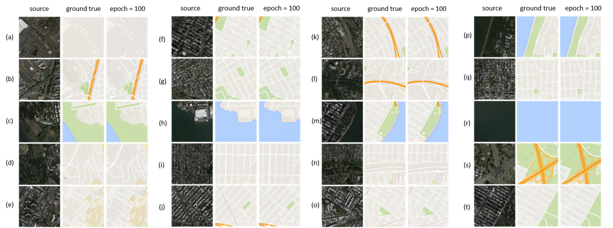
> Figure 9. for the experiment of Pix2pix for sat2google, the result seems fair. Most of the generated features, such as buildings, waterbodies, roads, and green space are located correctly, with shapes and colors matching with the ground truth.

### 4.2. CycleGAN-sat2google, sat2baidu, sat2worldmap

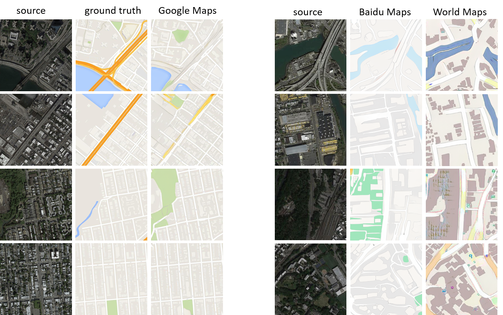
> Figure 10. First, for sat2google, the roads seem not be captured very well, but the green space seem even more fitting compared with the ground truth. As for sat2baidu and sat2worldmap, Both results are not very realistic, although most of the ground features still can be captured, such as roads and rivers.

### 4.3 BicycleGAN-sat2google-CycleGAN-sat2google

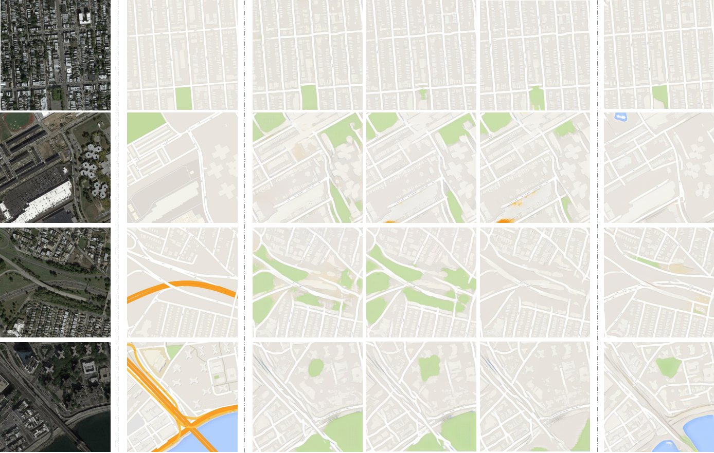
> Figure 11. Next is the result from BicycleGAN for sat2google, with a comparison to CycleGAN. Although BicycleGAN can produce multiple styles for the google maps, yet many green space regions are overfitting. Specifically, BicycleGAN misinterprets the waterbodies as the green space, while the CycleGAN can capture waterbodies correctly.

### 4.4 StarGAN-sat2all

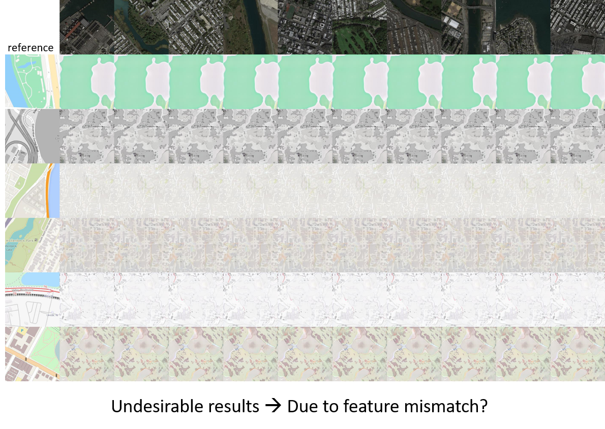
> Figure 12. Lastly, it is the result from StarGAN for sat 2 all maps. As we can see, the results are barely desirable. The model only capture the latent code of the targeted domain, but cannot recognize the features’ locations and shapes. We assume this issue might be due to feature mismatch. So, the original dataset for the stargan paper is human face, and each image has all face features such as eyes, nose, mouth, etc. But as for the datasets in map generation, each image does not necessarily have all ground features, such as buildings, waterbodies, roads, green space, etc. Therefore, stargan may not be suitable for map synthesis here.

### 5. Evaluation

#### 5.1. Human metrics - Amazon Mechanical Turk (AMT)

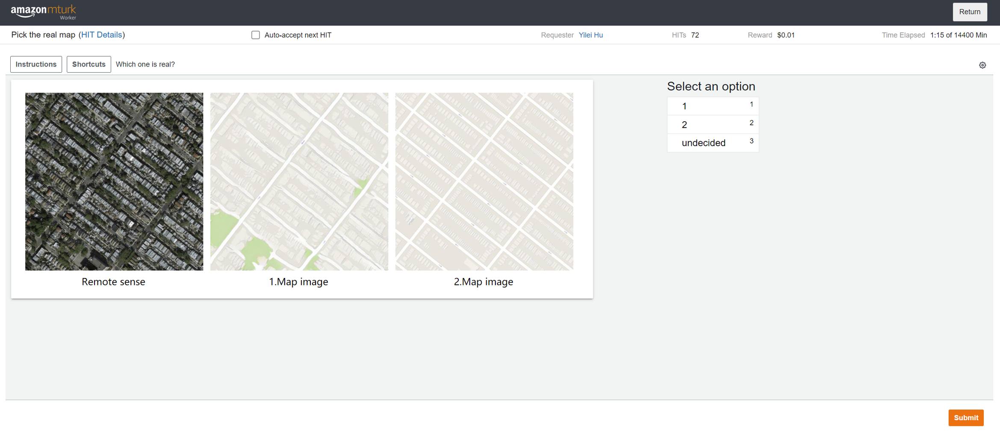
> Figure 13. AMT task interface

#### 5.2. Quantitative

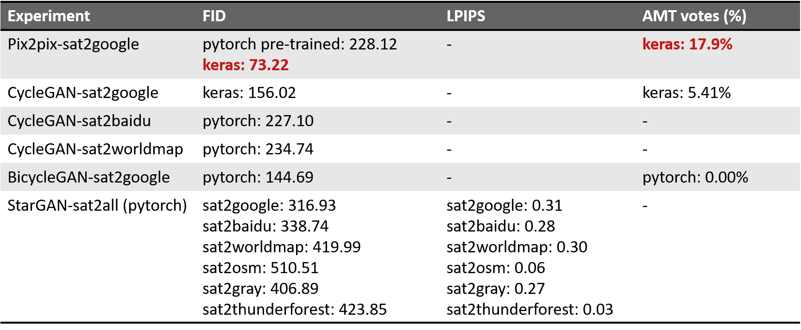
> Figure 14. Finally, it’s the evaluation for each experiment. As we can see, the Pix2pix model implemented by keras achieves the best performance, based on both FID scores and AMT votes. Followed by the performances of cyclegans and bicyclegan. What is FID/LPIPS? Fréchet Inception Distance: The Fréchet inception distance (FID) is a metric used to assess the quality of images created by GANs.[1] Unlike the earlier inception score (IS), which evaluates only the distribution of generated images, the FID is a metric that calculates the distance between the feature vectors calculated for real and generated images. The score summarizes how similar the two groups are in terms of statistics on computer vision features using the inception v3 model for image classification. Lower scores indicate the two groups of images are more similar, or have more similar statistics. LPIPS - learned perceptual image patch similarity It calculates the similarity of two patches based on the learnt perceptions just like human.

## 6. Discussions

### 6.1. Highlights of learning:

1. GANs being powerful in map synthesis;
2. Better understanding the core ideas, architectures, pros & cons of different GANs;
3. Implementing different GANs;
4. Evaluating of the performances of GANs.

### 6.2. Future works:

1. To explore the multispectral information of satellite images;
2. To try image segmentation for different ground features;
3. To design a “one-for-all” GAN model for map synthesis.

## Major References

1. Ganguli, S., Garzon, P., & Glaser, N. (2019). GeoGAN: A Conditional GAN with Reconstruction and Style Loss to
   Generate Standard Layer of Maps from Satellite Images. ArXiv.
2. Goodfellow, I., Pouget-Abadie, J., Mirza, M., Xu, B., Warde-Farley, D., Ozair, S., Courville, A., & Bengio, Y. (2014)
   . Generative adversarial networks. Communications of the ACM, 63(11), 139–144. https://doi.org/10.1145/3422622
3. Isola, P., Zhu, J. Y., Zhou, T., & Efros, A. A. (2017). Image-to-image translation with conditional adversarial
   networks. Proceedings - 30th IEEE Conference on Computer Vision and Pattern Recognition, CVPR 2017, 2017-Janua,
   5967–5976. https://doi.org/10.1109/CVPR.2017.632
4. Li, J., Chen, Z., Zhao, X., & Shao, L. (2020). MAPGAN: An intelligent generation model for network tile maps.
   Sensors (Switzerland), 20(11). https://doi.org/10.3390/s20113119
5. Mirza, M., & Osindero, S. (2014). Conditional Generative Adversarial Nets. 1–7. http://arxiv.org/abs/1411.1784
6. Zhu, J. Y., Park, T., Isola, P., & Efros, A. A. (2017). Unpaired image-to-image translation using cycle-consistent
   adversarial networks. ArXiv, 2223–2232.
7. Brownlee, J. (2019) Generative Adversarial Networks with Python, Deep Learning Generative Models for Image Synthesis and Image Translation, Machine Learning Mastery. Machine Learning Mastery. Available at: https://books.google.com.sa/books/about/Generative_Adversarial_Networks_with_Pyt.html?id=YBimDwAAQBAJ&redir_esc=y%0Ahttps://machinelearningmastery.com/generative_adversarial_networks/. 
8. Zhu, J. Y. et al. (2017) ‘Toward multimodal image-to-image translation’, Advances in Neural Information Processing Systems, 2017-December(1), pp. 466–477.
9. Choi, Y. et al. (2020) ‘StarGAN v2: Diverse Image Synthesis for Multiple Domains’, Proceedings of the IEEE Computer Society Conference on Computer Vision and Pattern Recognition, pp. 8185–8194. doi: 10.1109/CVPR42600.2020.00821.
10. Heusel, M. et al. (2017) ‘GANs trained by a two time-scale update rule converge to a local Nash equilibrium’, Advances in Neural Information Processing Systems, 2017-December(Nips), pp. 6627–6638.
11. Zhang, R. et al. (2018) ‘The Unreasonable Effectiveness of Deep Features as a Perceptual Metric’, Proceedings of the IEEE Computer Society Conference on Computer Vision and Pattern Recognition, (1), pp. 586–595. doi: 10.1109/CVPR.2018.00068.
