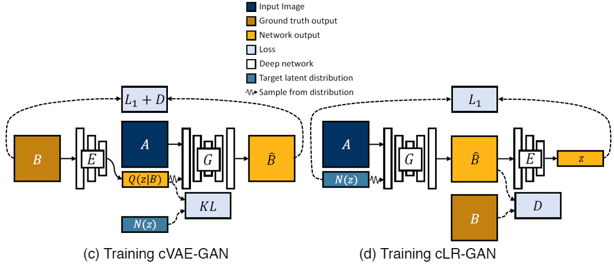
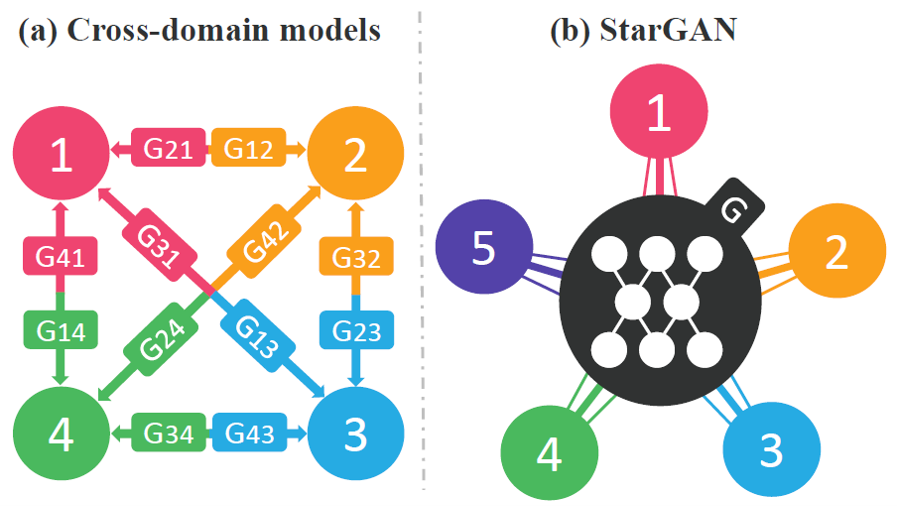
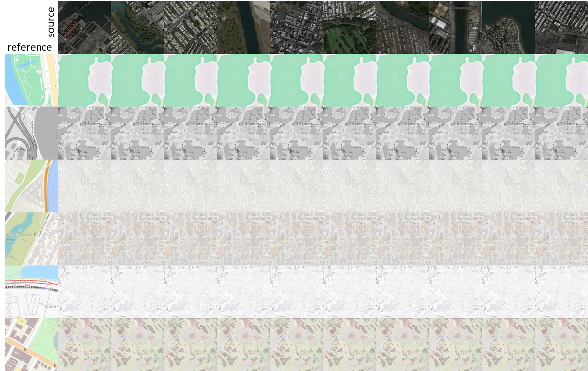
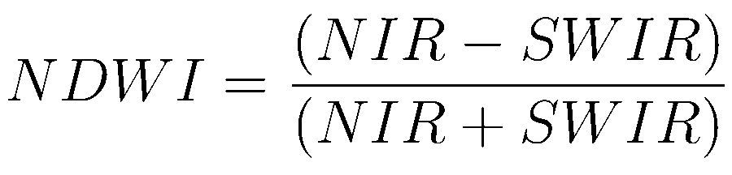

# Map synthesis based on satellite images

## Table of Contents
<!--ts-->
* [Motivation](#motivation)
* [Literature Review](#literature-review)
* [Methodology](#methodology)
	* [Datasets](#datasets)
	* [State-of-the-art models for image translation and implementations](#state-of-the-art-models-for-image-translation-and-implementations)
		* [Pix2pix](#pix2pix)
		* [CycleGAN](#cycleGAN)
		* [BicycleGAN](#bicycleGAN)
		* [StarGAN](#starGAN)
	* [Workflow](#workflow)
* [Results and analysis](#results-and-analysis)
	* [Pix2pix-sat2google](#pix2pix-sat2google)
	* [CycleGAN-sat2google sat2baidu sat2worldmap](#cycleGAN-sat2google-sat2baidu-sat2worldmap)
	* [BicycleGAN-sat2google vs CycleGAN-sat2google](#bicycleGAN-sat2google-vs-cycleGAN-sat2google)
	* [StarGAN-sat2all](#starGAN-sat2all)
* [Evaluation](#evaluation)
	* [Human metrics-Amazon Mechanical Turk](#human-metrics-amazon-mechanical-turk)
	* [Quantitative metrics](#quantitative-metrics)
* [Discussions](#discussions)
	* [Highlights of learning](#highlights-of-learning)
	* [Future works](#future-works)
<!--te-->

## Motivation

> Figure 1. The question of our project.

Map-related services are essential in our daily life, as we utilize maps for various scenarios and applications, e.g., daily
commuting navigation, logistics distribution system, queries and visualization of geographic information, request of
high-definition maps for self-driving vehicles, etc. Therefore, generating applicable maps and maintaining their latest
versions are important tasks, which, unfortunately, can be a laborious and time-consuming process. Nowadays, most maps
are created and updated based on the interpretation of satellite images and field surveys. On the bright side,
with the rapid development of remote sensing technologies, many high spatial resolution (HSR) satellite images with a
global coverage can be obtained frequently by sensors on aircraft/satellites. Thus, **generating map tiles automatically
and aesthetically based on satellite images** has become an emerging research direction for mapping agencies and
institutions.

## Literature Review

**Generative Adversarial Network (GAN)**, a framework for estimating generative models via an adversarial process, was
first proposed (Goodfellow et al., 2014) with two models being trained simultaneously: a generative model G that
captures the data distribution, and a discriminative model D that estimates the probability that a sample came from the
training data rather than G. The training procedure for G is to maximize the probability of D making a mistake. This
framework corresponds to a minimax two-player game.

Later, researchers have experimented with their proposed GANs on the translation task using satellite images and
Google maps. However, the purpose of previous map translation tasks was mainly to prove the feasibility of their
proposed model. That is, as long as the generated images were in the style of applicable electronic maps, they were
satisfied with the results, even although the quality of generated maps was far from ideal, and it was easy for people
to distinguish between the real electronic maps and the generated ones. For example, Pix2pix (Isola et al., 2017)
established a general framework for image translation based on a CGAN (Mirza & Osindero, 2014). However, satisfactory
results cannot be achieved in specific scenarios, and the quality of the generated electronic map is poor. A
breakthrough of CycleGAN (Zhu et al., 2017) is its ability to solve the problem of image translation in cases where
paired training datasets cannot be obtained. When it is applied in the map translation scenario, it is still found that
the resulting electronic map has many problems, such as image blurring, unclear texture, and incorrect color rendering.
Furthermore, there are two other recent, promising, and GAN-based studies for image translation, e.g., BicycleGAN (Zhu et al., 2017) and StarGAN (Choi et al., 2020), which focus on generating images with multiple styles/domains, and therefore are well worth exploring.

## Methodology

### Datasets

> Figure 2. Seven datasets with detailed information in our project. 

The first one is satellite images, which are the source for image translation. On the other hand, we collected six different kinds of targeted maps, such as google maps, baidu maps, world maps, etc. These datasets have been uploaded to our github website and can be found in their corresponding experiments under the "data" folder.

### State-of-the-art models for image translation and implementations

> Figure 3. Summary of four state-of-the-art models for image translation.

#### Pix2pix

> Figure 4. The architecture of pix2pix. 

Basically, pix2pix architecture includes a U-net Generator and a PatchGAN discriminator. It is easy to implement with less computations, however, one of its disadvantages is that it requires paired datasets for model training. 

#### CycleGAN

> Figure 5. The architecture of CycleGan. 

CycleGan doesn't require paired datasets for model training. The architecture of CycleGAN includes two generators G and F. G generates Y domain images based on X domain input, while F generates the versus. The cycle process is constrained by the cycle-consistency loss. However, one of the disadvantages for CycleGAN is lacking diversity of styles for the output.

#### BicycleGAN

> Figure 6. The architecture of BicycleGAN. (c) cVAE-GAN (and cAE-GAN) starts from a ground truth target image B and encode it into the latent space. The generator then attempts to map the input image A along with a sampled z back into the original image B. (d) cLR-GAN randomly samples a latent code from a known distribution, uses it to map A into the output ^B
, and then tries to reconstruct the latent code from the output.

Our hybrid BicycleGAN method combines constraints in both directions (c) and (d), which consists of two cycle processes. One involves the ground truth B versus the output B hat, And the other cycle is about a randomly sampled latent code versus the reconstructed latent code. With this architecture, BicycleGAN can produce multiple styles for the targeted domain. However, one of the weaknesses is that BicycleGAN performs image translation only between two domains. 

> We implemented BicycleGAN as the pytorch default setting in our project, and you could check it out in our github "code" folder For more details. 

#### StarGAN

> Figure 7. The architecture of StarGAN, consisting of two modules, a discriminator D and a generator G. (a) D learns to distinguish between real and fake images and classify the real images to its corresponding domain. (b) G takes in as input both the image and target domain label and generates an fake image. The target domain label is spatially replicated and concatenated with the input image. (c) G tries to reconstruct the original image from the fake image given the original domain label. (d) G tries to generate images indistinguishable from real images and classifiable as target domain by D.

> StarGAN can produce multiple domains with only ONE generator, instead of calculating n * (n-1) generators if there are n domains.

> Figure 8. The upgrade of StarGAN-v2, consisting of four modules. (a) The generator translates an input image into an output image reflecting the domain-specific style code. (b) The mapping network transforms a latent code into style codes for multiple domains, one of which is randomly selected during training. (c) The style encoder extracts the style code of an image, allowing the generator to perform referenceguided image synthesis. (d) The discriminator distinguishes between real and fake images from multiple domains. Note that all modules except the generator contain multiple output branches, one of which is selected when training the corresponding domain. 

> We implemented StarGAN-v2 as the pytorch default setting in our project, and you could check it out in our github "code" folder For more details. 

### Workflow

> Figure 9. Project workflow with 6 experiments. 

We conducted 6 experiments with different GAN models and different targeted domains. Each experiment will be fed with its corresponding training input, and then produce the output. And each output will be evaluated by quantitative metrics (e.g., FID and LPIPS) as well as human evaluation (e.g., Amazon Mechanical Turk).

## Results and analysis

### Pix2pix-sat2google

> Figure 10. The results of Pix2pix-sat2google.

For the experiment of Pix2pix for sat2google, the result seems fair. Most of the generated features, such as buildings, waterbodies, roads, and green space are located correctly, with shapes and colors matching with the ground truth.

### CycleGAN-sat2google sat2baidu sat2worldmap

> Figure 11. The results of CycleGAN-sat2google, sat2baidu, sat2worldmap.

1. For sat2google, the roads are not captured very well, but the green space seems even more fitting compared with the ground truth. 
2. As for sat2baidu and sat2worldmap, both results do not seem realistic, although most of the ground features still can be captured, such as roads and rivers.

### BicycleGAN-sat2google vs CycleGAN-sat2google

> Figure 12. The results of BicycleGAN-sat2google vs. CycleGAN-sat2google.

Next is the result from BicycleGAN for sat2google, with a comparison to CycleGAN. Although BicycleGAN can produce multiple styles for the google maps, yet many green space regions are overfitting. Specifically, BicycleGAN misinterprets the waterbodies as the green space, while the CycleGAN can capture waterbodies correctly.

### StarGAN-sat2all

> Figure 13. The results of StarGAN-sat2all. 

As we can see, the results are barely desirable. The model only capture the latent code of the targeted domain, but cannot recognize the features’ locations and shapes. We assume this issue might be due to feature mismatch. Specifically, the original dataset for the StarGAN paper is images with human faces, and each image has all face features such as eyes, nose, mouth, etc. But as for the datasets fpr map generation, each image does not necessarily have all ground features, such as buildings, waterbodies, roads, green space, etc. Therefore, StarGAN may not be suitable for map synthesis here.

### Evaluation

#### Human metrics-Amazon Mechanical Turk

> Figure 14. Amazon Mechanical Turk (AMT) task interface.

#### Quantitative metrics

> Figure 15. Quantitative evaluation for each experiment. 

As we can see, the Pix2pix model implemented by keras achieves the best performance, based on both FID scores and AMT votes. Followed by the performances of Cyclegans and Bicyclegan. 
> The Fréchet inception distance (FID) is a metric used to assess the quality of images created by GANs. Unlike the earlier inception score (IS), which evaluates only the distribution of generated images, the FID is a metric that calculates the distance between the feature vectors calculated for real and generated images. The score summarizes how similar the two groups are in terms of statistics on computer vision features using the inception v3 model for image classification. Lower scores indicate the two groups of images are more similar, or have more similar statistics. 

> LPIPS means learned perceptual image patch similarity. It is another evaluation metrics for GANs and calculates the similarity of two patches based on the learnt perceptions just like human.

## Discussions

### Highlights of learning

1. GANs are powerful and applicable in map synthesis;
2. We gained a better understanding the core ideas, architectures, pros & cons of different GANs;
3. We learnt to implement different GANs;
4. We conducted evaluations of the performances of GANs with different metrics.

### Future works

1. To explore the multispectral information of satellite images;
	- In the field of remote sensing, it is well-known that waterbodies and vegetations could be distinguished by specific combinations of different reflected spectrums/bands, e.g., using the equations of Normalized Difference Water Index (NDWI) and Normalized Difference Vegetation Index (NDVI).

> NDWI can be calculated by Near Infrared (NIR) and SWIR bands.

> NDVI can be calculated by Near Infrared (NIR) and Visual bands.

2. To try image segmentation for different ground features;
	- Currently, it is common to use PatchGAN as the discriminator of GAN models. However, this process does not take the connectedness of group features into consideration when the model is trying to tell whether the image is real or fake. For example, roads are usually in a curve or straight line shape with a relatively longer length, therefore one patch may only capture a small part of one road, which may not showing the main characteristics of road features. 
	- This issue could be improved if we apply image segmentation to the images and classify each segment as one type of the ground features, instead of using PatchGAN technique.
3. To design a “one-for-all” GAN model for map synthesis.
	- It is still desirable if we could derive a GAN-related model with ONE generator and ONE discriminator to translate satellite images into different kinds of maps.

## Acknowledgement
Previsouly we encoutered an issue about computation resources mentioned in our mid-report. This issue was solved later by using a server from the Spatial Computing and Data Mining Lab at UW-Madison. We would like to thank them for their great support in our project.

## Major References

1. Ganguli, S., Garzon, P., & Glaser, N. (2019). GeoGAN: A Conditional GAN with Reconstruction and Style Loss to
   Generate Standard Layer of Maps from Satellite Images. ArXiv.
2. Goodfellow, I., Pouget-Abadie, J., Mirza, M., Xu, B., Warde-Farley, D., Ozair, S., Courville, A., & Bengio, Y. (2014)
   . Generative adversarial networks. Communications of the ACM, 63(11), 139–144. https://doi.org/10.1145/3422622
3. Isola, P., Zhu, J. Y., Zhou, T., & Efros, A. A. (2017). Image-to-image translation with conditional adversarial
   networks. Proceedings - 30th IEEE Conference on Computer Vision and Pattern Recognition, CVPR 2017, 2017-Janua,
   5967–5976. https://doi.org/10.1109/CVPR.2017.632
4. Li, J., Chen, Z., Zhao, X., & Shao, L. (2020). MAPGAN: An intelligent generation model for network tile maps.
   Sensors (Switzerland), 20(11). https://doi.org/10.3390/s20113119
5. Mirza, M., & Osindero, S. (2014). Conditional Generative Adversarial Nets. 1–7. http://arxiv.org/abs/1411.1784
6. Zhu, J. Y., Park, T., Isola, P., & Efros, A. A. (2017). Unpaired image-to-image translation using cycle-consistent
   adversarial networks. ArXiv, 2223–2232.
7. Brownlee, J. (2019) Generative Adversarial Networks with Python, Deep Learning Generative Models for Image Synthesis and Image Translation, Machine Learning Mastery. Machine Learning Mastery. Available at: https://books.google.com.sa/books/about/Generative_Adversarial_Networks_with_Pyt.html?id=YBimDwAAQBAJ&redir_esc=y%0Ahttps://machinelearningmastery.com/generative_adversarial_networks/. 
8. Zhu, J. Y. et al. (2017) ‘Toward multimodal image-to-image translation’, Advances in Neural Information Processing Systems, 2017-December(1), pp. 466–477.
9. Choi, Y. et al. (2020) ‘StarGAN v2: Diverse Image Synthesis for Multiple Domains’, Proceedings of the IEEE Computer Society Conference on Computer Vision and Pattern Recognition, pp. 8185–8194. doi: 10.1109/CVPR42600.2020.00821.
10. Heusel, M. et al. (2017) ‘GANs trained by a two time-scale update rule converge to a local Nash equilibrium’, Advances in Neural Information Processing Systems, 2017-December(Nips), pp. 6627–6638.
11. Zhang, R. et al. (2018) ‘The Unreasonable Effectiveness of Deep Features as a Perceptual Metric’, Proceedings of the IEEE Computer Society Conference on Computer Vision and Pattern Recognition, (1), pp. 586–595. doi: 10.1109/CVPR.2018.00068.
